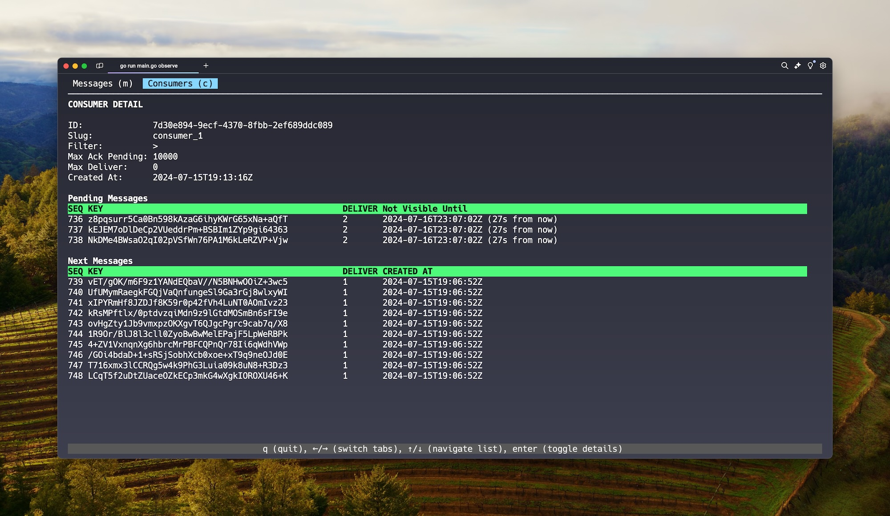

# Sequin

> [!IMPORTANT]
> Sequin is still under rapid development and the API is still stabilizing. It should be considered **pre-1.0**.

## What is Sequin?

Sequin turns the Postgres WAL into a message queue (technically a stream). It's an open-source, stateless Docker container that works with any Postgres database.

Sequin makes it easy to stream creates, updates, and deletes from any table in Postgres to your app. It supports both pull-based and push-based (via webhook) consumption patterns.

Sequin is a great fit if LISTEN/NOTIFY's at-most-once delivery is not sufficient for your use case. And it gives you way more features than Debezium/Kafka, all built on Postgres.

Get a feature-rich system like RabbitMQ's via a straightforward HTTP API without adding complexity to your stack.

### Key Features:

- **At-least-once delivery**: All the guarantees you expect of a message queue.
- **Expressive reads**: Consume messages with expressive filtering.
- **Simple stack**: Extend your existing Postgres database into a message queue.
- **Predictable scaling**: If Postgres can handle your data, Sequin can as well.
- **Use SQL**: Pop the hood and observe or manage your queues with SQL.
- **HTTP interface**: Simple interface with pull and push-based consumption.
- **Any table**: Stream inserts, updates, and deletes from existing tables with one command.

## Core concepts

### Messages

A **message** in Sequin consists of a `key` and a `data` payload.

### Key

In Sequin, a **key** is a string that serves two purposes:

1. It acts as the identifier for the message
2. It contains attributes that can be used for consumer filtering

As you'll see, consumers use the key to filter the messages they process.

Keys are auto-generated by Sequin and follow this format:

`[database-name].[schema].[table-name].[operation].[record-id]`

For example, a change to the orders table might have a key like:

`mydb.public.orders.update.ord_1`

> [!NOTE]
> Ability to remap keys to a different shape according to a row's properties coming soon.

### Consumers

A **consumer** is how to read messages with delivery guarantees.

#### Key filter

Consumers are configured with a **key filter** which determines which messages are available to that consumer. These filters follow the [NATS standard](https://docs.nats.io/nats-concepts/subjects). The key filter can match on tokens and can include wildcards:

- The wildcard `*` matches a single token.
- The wildcard `>` will match one or more tokens and can only appear at the end of the filter.

For instance, `mydb.public.orders.update.>` will return all updates to the `orders` table where as `mydb.public.users.>` will return all events for the `users` table.

#### At-least-once with retries

Your system receives messages from a consumer and then acks them once they have been processed.

If your system doesn’t ack a message within a consumer’s `ack-wait-ms` period, the message will become available again to that consumer. (`ack-wait-ms` is configurable.)

#### Concurrent

Multiple workers can concurrently receive messages from a consumer. Messages are only delivered once during the `ack-wait-ms` period. If the message is not ack’d before the period elapses, the message becomes available again.

## Guarantees

### At-least-once delivery

Sequin guarantees that all your messages will be delivered for a given consumer to your workers.

### Exactly-once processing

Sequin will keep delivering a message until it is acknowledged (or hits a `max-deliver` threshold you configure).

### Strict ordering by message key

Messages with the same key will always be delivered to a consumer's workers in order.

If you've set `one-message-per-key=true` for a stream, then all message key conflicts are upserts. If a message has been delivered but not ack'd (is currently being worked), then delivery of the next message with that key will be withheld. When the `ack-wait-ms` expires or the message is ack'd/nack'd, the latest version of the message will be available for delivery.

If you've set `one-message-per-key=false` for a stream, then messages are appended to a stream. Still, if a message has been delivered but not ack'd (is currently being worked), then delivery of the next message with that key will be withheld until that message has finished processing.

## Streaming from an existing Postgres table

You can use Sequin to treat the creates, updates, and deletes from any existing Postgres table as a stream of messages.

From the CLI, connect any Postgres table to Sequin:

```
sequin source postgres add
```

The CLI will walk you through setting up a replication slot and publication.

### Comparison to WAL

The WAL must be processed in serial. This makes it hard to scale, as you can only have one worker safely consume from it. And any one slow or corrupt message will jam your pipeline.

With Sequin, WAL messages can be fanned out to many consumers for parallel processing and independent handling. (To make this safe, messages with the same key will [always be delivered in serial](#how-it-works).)

### Comparison to LISTEN/NOTIFY

Postgres' LISTEN/NOTIFY pushes notifications to your system whenever certain changes occur in Postgres. Because it's an at-most-once system, it works OK if you're fine with missing messages. But if your listening processes are not connected to the database during a NOTIFY event, they will miss that event.

Sequin offers at-least-once delivery and first-class features like fan-out and replay.

## Setup

### Server

Run the server with Docker/compose. After cloning the repo:

```bash
cd docker && docker compose up -d
```

The server runs on `localhost:7376`. The CLI is configured to point to `localhost:7376` by default.

### CLI

Install with Homebrew:

```bash
brew tap sequinstream/homebrew-sequin
brew install sequin
```

Install with shell:

```bash
curl -sf https://raw.githubusercontent.com/sequinstream/sequin/main/cli/installer.sh | sh
```

To build from source, clone this repo then:

```bash
cd cli && make build
```

Reload your console and test that it's installed:

```bash
sequin --help
```

## Getting Started

See the [getting started guide](./getting-started-wal.md).

## CLI

Sequin comes with a CLI you can use to interact with and observe a running Sequin instance. You can use the CLI to set up streams and consumers, and observe messages flowing through your system in real-time.

### `--as-curl`

For every CLI command, you can pass the `--as-curl` flag to have the command printed out as a curl request:

```bash
sequin consumer receive mycon --batch-size=10 --as-curl
```

### Contexts

You can use contexts to easily switch your CLI between environments. For example, if you're debugging production, you can run:

```bash
sequin observe --context=prod
```

And the Sequin CLI will use your settings for prod to connect to your production Sequin instance.

Create a context with the walkthrough:

```bash
sequin context create [<flags>] [<name>]
```

### Observe

Sequin's `observe` is like [htop](https://github.com/htop-dev/htop) for your Sequin instance. You can watch messages flow into your system, into a consumer's outbox, and get ack'd in real-time.

Boot it with:

```bash
sequin observe
```



## Sending messages

You can send a message to Sequin by specifying the `key` and the `data` payload:

```bash
sequin message send orders.cus_a.ord_1jNsd '{ "quantity": 4 }'
```

When sending via HTTP, `messages` can contain a list of 1 or more messages:

```bash
curl -X 'POST' -d '{"messages":[{"data":"{ \"quantity\": 4 }","key":"orders.cus_a.ord_1jNsd"}]}' \
-H 'Content-Type: application/json' \
-H 'Authorization: Bearer {token} \
'https://[sequin-base-url]/api/streams/68658e3e-de48-4005-a5de-2a7cd6868d80/messages'
```

The maximum batch size per send request is 10,000 messages. We generally recommend smaller batch sizes if each message is large. Keeping the entire batch to under ~10MB is usually a good rule for most systems.

## Streams

A **stream** is a table of messages. When you send a message to Sequin, it is stored in a stream. [Consumers](#consumers) are how you read messages from the stream with delivery guarantees.

If you're just starting out, using a single stream for all your data is sufficient. You'll use separate streams when you want to have different policies for a set of messages. They can also be helpful when scaling, as each stream is a separate Postgres table under the hood.

To add a stream to Sequin, run:

```bash
sequin stream add [<stream-name>] [<flags>]
```

### Policies

Streams can be configured with a number of different policies that affect message processing and retention:

#### `one-message-per-key=[<bool>]`

When `one-message-per-key` is set to `true`, Sequin places a unique constraint on message's `key`. All messages will be upserted. There will only ever be one message with a given key in the stream, the last message with that key received.

This setting is a great fit for processing [records](#terminology), where only the latest version of a message matters to your system.

#### `process-unmodified=[<bool>]`

Must be used in combination with `one-message-per-key=true` and defaults to `false`. When `process-unmodified` is false, a stream will ignore messages that (1) have a key that matches an existing message in the stream and (2) are unchanged (according to a SHA256 hash of `data`). This saves the stream from re-inserting the message and all consumers from re-processing it.

You can set this setting to `true` if you want messages to be reprocessed by consumers, even if their contents haven't changed. This can be useful for processing [command messages](#terminology), where the contents don't change but you still want your system to reprocess them.

#### `max-storage=[<gigabytes>]gb`

The approximate maximum storage (in gigabytes) that a stream can expand to.

When a stream hits `max-storage`, messages will be evicted oldest-first, respecting `retain-at-least`.

Postgres' analytics around storage are approximate, so we recommend ensuring a 20% buffer. i.e. if you set a stream's `max-storage` to 100GB, you should ensure that your Postgres volume is able to accommodate a 120GB stream.

#### `retain-up-to=[<duration>]`

Messages that are older than `duration` will be evicted from the stream.

#### `retain-at-least=[<duration>]`

Must be used in combination with `max-storage`. `retain-at-least` is a safety mechanism. It ensures that if a stream hits `max-storage`, Sequin will never evict messages younger than `retain-at-least`. You can set `retain-at-least=infinite` to ensure nothing is evicted.

If a stream hits `max-storage` but can no longer evict messages according to `retain-at-least`, it will stop receiving messages.

It can be a good idea to set `retain-at-least` if you're setting `max-storage`. If your stream starts growing unexpectedly, the combination of these two settings can act as a failsafe.

## Consumers

**Consumers** are central to Sequin. A consumer is how workers in your system receive messages. Using consumers allow you to:

- Filter the message stream down to what a given worker/system cares about
- Safely process messages concurrently
- Ensure messages are processed exactly once

To add a consumer to Sequin, run:

```bash
sequin consumer add [<stream-name>] [<consumer-name>] [<flags>]
```

For example:

```bash
# Create a consumer for all orders in the system
sequin consumer add mystream mycon --ack-wait-ms=60000 --filter="orders.>"
```

The flags:

```bash
  --ack-wait-ms=ACK-WAIT-MS          Acknowledgement wait time in milliseconds
  --max-ack-pending=MAX-ACK-PENDING  Maximum number of pending acknowledgements
  --max-deliver=MAX-DELIVER          Maximum number of delivery attempts
  --max-waiting=MAX-WAITING          Maximum number of waiting messages
  --filter=FILTER                    Key pattern for message filtering
  --[no-]defaults                    Use default values for non-required fields
```

When no flags are provided, the CLI will walk you through setup.

### Receiving messages

To receive a message for a consumer, run:

```bash
sequin receive [<stream-name>] [<consumer-name>]  [<flags>]
```

For example:

```bash
sequin receive mystream mycon --batch-size=10
```

Or, via HTTP:

```bash
curl -X 'GET' https://[sequin-base-url]/api/streams/mystream/consumers/mycon/next?batch_size=10'
```

The CLI will automatically ack messages upon receipt. You can disable this behavior by passing the `--no-ack` flag:

```bash
sequin receive mystream mycon --batch-size=10 --no-ack
```

After a batch of messages is delivered to your worker, those messages will not be available to other workers for that consumer for `ack-wait-ms`. Messages are delivered with an `ack_id` that your worker will [use to ack them](#acking-messages).

### Acking messages

After your system receives messages from a consumer, it will process them. When it's finished processing, it should ack those messages. Ack'ing ensures those messages will not be redelivered and is how Sequin guarantees exactly-once processing.

You ack messages using their `ack_id`. The `ack_id` for each message is included with every delivery.

Using the CLI:

```bash
sequin consumer ack [<stream-name>] [<consumer-name>] [<ack_id>]
```

When ack'ing via HTTP, you can include a batch of ack_ids to acknowledge all together:

```bash
curl -X 'POST' -d '{"ack_ids":["ack_1jdiQuj"]}' -H 'Content-Type: application/json' 'https://[sequin-base-url]/api/streams/mystream/consumers/mycon/ack'
```

### Nacking messages

You can also "negative ack" or "nack" messages. This makes the messages available again for immediate redelivery.

Using the CLI:

```bash
sequin consumer nack mystream mycon [<ack_id>]
```

When nack'ing via HTTP, you can include a batch of ack_ids to nack all together:

```bash
curl -X 'POST' -d '{"ack_ids":["ack_1jdiQuj"]}' -H 'Content-Type: application/json' 'https://[sequin-base-url]/api/streams/mystream/consumers/mycon/nack'
```

Nacking is an advanced feature. Usually, it's fine to just let the `ack-wait-ms` for a message expire and have it be redelivered that way.

### Peeking messages

For debugging purposes, you can also "peek" at messages and their states for a consumer. Peeking lets you see the delivered messages and upcoming messages, without affecting their states.

You can peek via the CLI:

```bash
sequin consumer peek [<flags>] [<stream-id>] [<consumer-id>]
```

Or via HTTP:

```bash
curl -X 'GET' 'https://<sequin-base-url>/api/streams/<stream-name>/consumers/<consumer_name>/messages?limit=10&sort=seq_desc&visible=true'
```

You can also view consumer states in real-time with [observe](#observe).

### Learn more

This is just a subset of consumer configuration and usage. Learn more by running `sequin consumer --help`.

## How it works

The Sequin server is a stateless Docker container that sits in front of any Postgres database. It provides an HTTP interface for sending and receiving messages, as well as managing the system.

Sequin uses a Postgres schema (default: `sequin_config`) to store metadata about streams, consumers, and other objects.

For the streams themselves, Sequin uses a separate Postgres schema (default: `sequin_stream`). That schema can live on a different Postgres database from the config.

There are two tables in `sequin_stream`: `messages` stores all the messages and `consumer_messages` stores the state of available and delivered messages for each consumer. `messages` is partitioned by stream. And `consumer_messages` is partitioned by consumer.

New messages are written to `messages` and fanned out to `consumer_messages` in the same transaction.

On insert, a message's `key` is tokenized and broken out across 16 token columns. This allows Sequin to leverage Postgres indexes for fast message lookups by key pattern (e.g. `payroll.adp.*.employee.*`).

### Design considerations

We tried and benchmarked several solutions, some that we felt were very clever. But we landed on a `messages` table with an outbox pattern (`consumer_message`) because it's both simple and performant!

Because consumer-message state needs to be tracked on disk, a `consumer_message` row needs to be created _at some point_. We decided it was best to do that on message insert. By moving more load to writes, we can avoid a situation where the system can write a lot faster than it can read.

For the best performance, on top of intelligent indexes, we avoid trigger functions (degrade performance when batching) and are careful about constraints.

## Deployments

You can run Sequin anywhere you can run Docker. It stores its configuration state and streams in [Postgres](#how-it-works).

You can even "sidecar" Sequin alongside your app.

## Benchmarks and performance

Postgres is an extremely robust and high-performance system. It does a stellar job handling message streaming workloads like Sequin, when leveraged properly.

Performance is highly dependent on machine resources. But to give you an idea:

A `db.m5.xlarge` RDS instance (4 vCPU, 16 GB RAM, $260/mo) can handle **5,000 messages/second** with three consumers (concurrency of 50 instances reading and writing). It can burst up to 10k messages/second. This is the case with `batch_size=10` on both publish and receive.

Expect this performance to degrade with messages >256kb in size.

## FAQ

### What about exactly-once delivery?

Sequin offers at-least-once delivery and exactly-once processing (see [Guarantees](#guarantees)). You can configure how many times Sequin should attempt to redeliver a message with a consumer's `max-deliver` option (default: no limit).

Exactly-once delivery is a bit of a misnomer; it's always possible in a distributed system that a message will be sent and received, but the sender will not receive confirmation of receipt. In other words, cross-system two-phase commits can only get _asymptotically close_ to perfect.

## Roadmap

- Allow for streams to live on any database
- Control the size of `consumer_messages` – don't fan out to dormant consumers
- Client SDKs
