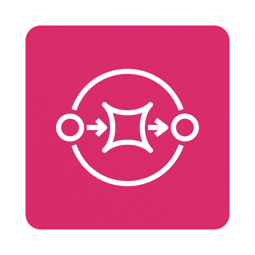

  <a href="https://sequinstream.com/docs">Documentation</a>
  ·
  <a href="https://sequinstream.com">Website</a>
  ·
  <a href="https://discord.gg/BV8wFXvNtY">Discord</a>
  ·
  <a href="https://join.slack.com/t/sequin-community/shared_invite/zt-37begzach-4aUwR5xt_XgivdvctZDemA">Slack</a>
  ·
  <a href="https://blog.sequinstream.com/">Blog</a>

# Sequin

Sequin is the [fastest](#performance) change data capture (CDC) platform for Postgres. Sequin makes it easy to stream Postgres to streaming platforms, queues, search indexes, and more (e.g. Kafka, GCP Pub/Sub, another Postgres, etc.). You can backfill existing rows and stream new changes in real-time.

Sequin is a standalone Docker container that you can deploy next to your Postgres database. Alternatively, you can use [our hosted offering](https://console.sequinstream.com) or we'll [manage Sequin](https://sequinstream.com/docs/sequin-managed/overview) for you in your cloud.

Sequin is [open source](./LICENSE). To help us make this project great, tell us what you're building in our [Discord server](https://discord.gg/BV8wFXvNtY) or [Slack community](https://join.slack.com/t/sequin-community/shared_invite/zt-37begzach-4aUwR5xt_XgivdvctZDemA).

## Getting started

See our [quickstart](https://sequinstream.com/docs/quickstart/webhooks) to get up and running in your dev environment in about 5 minutes.

Alternatively, you can try Sequin for free on [Sequin Cloud](https://console.sequinstream.com/register). Follow the instructions in the app to start streaming your data in a couple minutes.

## Performance

Sequin delivers industry-leading performance for change data capture (CDC), sustaining **50k operations per second** (40 MB/s) with **55ms average latency**.

| Tool / Deployment | Sustained throughput | Avg latency | 99p latency |
|-------------------|----------------------|-------------|-------------|
| **Sequin** | **>50 k ops / s** | **55 ms** | **253 ms** |
| Debezium · MSK | 6 k ops / s | 258 ms | 499 ms |
| Debezium · Server | 23 k ops / s | 210 ms  | 440 ms |
| Fivetran | - | 5+ minutes | - |
| Airbyte | - | 1+ hours | - |

Read more about our [benchmarking methodology and performance](https://sequinstream.com/docs/performance) in our docs.

## Use cases

Sequin works great for change data capture use cases like:

- **[Streaming events](https://sequinstream.com/docs/how-to/trigger-automated-workflows):** Stream database changes as events for other services to consume using Kafka, SQS, Pub/Sub and more.
- **[Audit logging](https://sequinstream.com/docs/how-to/create-audit-logs):** Track, enrich, and record every change in your database for compliance or feature development.
- **[Maintaining a cache](https://sequinstream.com/docs/how-to/maintain-caches):** Keep application caches in sync with your database by streaming changes to Redis compliant caches.
- **[Refreshing search indexes](https://sequinstream.com/docs/how-to/sync-search-indexes):** End-to-end tooling to warm search indexes like Typesense and Elasticsearch and keep them in sync with sub-second latency.

## Sinks

We're adding new destinations almost [every week](.CHANGELOG.md).

| Icon | Sink | Docs | Description |
|------|------|------|-------------|
|  | [Azure EventHubs](https://sequinstream.com/docs/quickstart/azure-event-hubs)  | [Reference](https://sequinstream.com/docs/reference/sinks/azure-event-hubs) | Publish messages to Azure EventHubs |
|  | [GCP Pub/Sub](https://sequinstream.com/docs/quickstart/gcp-pubsub) | [Reference](https://sequinstream.com/docs/reference/sinks/gcp-pubsub) | Publish messages to Google Cloud Pub/Sub topics |
|  | [Elasticsearch](https://sequinstream.com/docs/quickstart/elasticsearch) | [Reference](https://sequinstream.com/docs/reference/sinks/elasticsearch) | Index database changes with Elasticsearch |
|  | [Sequin Stream (HTTP `GET`)](https://sequinstream.com/docs/quickstart/sequin-stream) | [Reference](https://sequinstream.com/docs/reference/sinks/sequin-stream) | Consume changes directly from Sequin with exactly-once processing |
|  | [Kafka](https://sequinstream.com/docs/quickstart/kafka) | [Reference](https://sequinstream.com/docs/reference/sinks/kafka) | Stream changes to Apache Kafka topics |
|  | [Kinesis](https://sequinstream.com/docs/quickstart/kinesis) | [Reference](https://sequinstream.com/docs/reference/sinks/kinesis) | Send messages to Amazon Kinesis streams queues |
|  | [Meilisearch](https://sequinstream.com/docs/quickstart/meilisearch) | [Reference](https://sequinstream.com/docs/reference/sinks/meilisearch) | Index database changes with Meilisearch |
|  | [NATS](https://sequinstream.com/docs/quickstart/nats) | [Reference](https://sequinstream.com/docs/reference/sinks/nats) | Stream changes to NATS subjects |
|  | [RabbitMQ](https://sequinstream.com/docs/quickstart/rabbitmq) | [Reference](https://sequinstream.com/docs/reference/sinks/rabbitmq) | Publish messages to RabbitMQ exchanges |
|  | [Redis Stream](https://sequinstream.com/docs/quickstart/redis-stream) | [Reference](https://sequinstream.com/docs/reference/sinks/redis-stream) | `XADD` to Redis Streams |
|  | [Redis String](https://sequinstream.com/docs/quickstart/redis-string) | [Reference](https://sequinstream.com/docs/reference/sinks/redis-string) | `SET` to Redis keys  |
|  | [S2](https://sequinstream.com/docs/quickstart/s2) | [Reference](https://sequinstream.com/docs/reference/sinks/s2) | Send messages to S2 streams |
|  | [SQS](https://sequinstream.com/docs/quickstart/sqs) | [Reference](https://sequinstream.com/docs/reference/sinks/sqs) | Send messages to Amazon SQS queues |
|  | [SNS](https://sequinstream.com/docs/quickstart/sns) | [Reference](https://sequinstream.com/docs/reference/sinks/sns) | Send messages to Amazon SNS |
|  | [Typesense](https://sequinstream.com/docs/quickstart/typesense) | [Reference](https://sequinstream.com/docs/reference/sinks/typesense) | Index database changes with Typesense |
|  | [Webhooks (HTTP `POST`)](https://sequinstream.com/docs/quickstart/webhooks) | [Reference](https://sequinstream.com/docs/reference/sinks/webhooks) | Send changes to any HTTP endpoint |

## Killer features

- **Bring your database:** Sequin is not an extension. It works with any Postgres database version 14\+.
- **Never miss a change:** Sequin ensures [100% delivery of database changes to sinks](https://sequinstream.com/docs/concepts/consistency-model) with strict ordering.
- **Filters:** Write custom [filters](https://sequinstream.com/docs/reference/filters) to exclude or include changes to sink.
- **Transforms**: [Transform](https://sequinstream.com/docs/reference/transforms) message payloads by writing functions in low-latency Elixir.
- **Routing:** [Route](https://sequinstream.com/docs/reference/routing) messages to specific topics, endpoints, or indexes.
- **Exactly-once processing:** Sequin ensures exactly-once processing of database changes using [idempotency keys](https://sequinstream.com/docs/reference/messages#idempotency).
- **Backfills:** [Backfill](https://sequinstream.com/docs/reference/backfills) sinks at any point in time. Run partial backfills to only replay specific rows.
- **Infrastructure as code:** Manage Sequin as code using a YAML file paired with the Sequin CLI. Or use our [Management API](https://sequinstream.com/docs/management-api/introduction).
- **Rich web console:** Your team can configure and monitor sinks from a full feature web console.
- **Observability:** Sequin ships a [Prometheus metrics endpoint](https://sequinstream.com/docs/reference/metrics).

## How Sequin works

Sequin connects to any Postgres database. Specify the schemas and tables you want to stream, as well as optional filters and transformations. Route changes to sinks like Kafka, Google Pub/Sub, Redis, etc.

When you setup a sink, you can opt to backfill data from the source table to the sink.

After setup, Sequin will stream new changes to the sink as they occur in real-time. If there are any issues with delivery, Sequin will automatically retry delivery with exponential backoff.

Sequin comes with a web console/UI for configuration and monitoring. You can also configure Sequin as code using [YAML config files](https://sequinstream.com/docs/reference/sequin-yaml) and our [Management API](https://sequinstream.com/docs/management-api/introduction).

## Why Sequin

We all know Postgres is great for storing and querying data. But what about when you need to stream changes to other systems?

Existing tools like Debezium require significant infrastructure to operate (Kafka), endless guess-and-check configuration, and limited tooling. Other ETL tools (e.g. Fivetran) run in batches and are expensive.

This leads many teams to build brittle, homegrown solutions that are difficult to maintain and lack essential features.

### Fast, simple, reliable Postgres CDC

Sequin provides fastest, simple Postgres CDC. It's tuned to Postgres to stream changes in real-time, provides strict guarantees, and doesn't require complex infrastructure to operate.

## Contributing

See [CONTRIBUTING.md](./CONTRIBUTING.md) for detailed instructions on how to contribute to Sequin.
