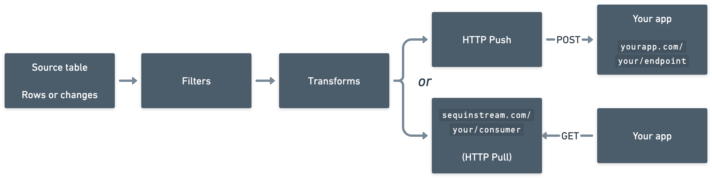

# Sequin

### Capture changes and stream data out of Postgres

 

  <a href="https://console.sequinstream.com">Sequinstream.com</a>
  ·
  <a href="https://sequinstream.com/docs">Documentation</a>
  ·
  <a href="https://sequinstream.com">Website</a>
  ·
  <a href="https://discord.gg/BV8wFXvNtY">Discord</a>

## What is Sequin?

Sequin is a tool for capturing changes and streaming data out of your Postgres database.

Sequin is great for:

1. **Replicating data** from your existing tables to other apps, databases, caches, materialized views, or frontend clients.
2. **Building event driven workflows** such as triggering side effects when data in Postgres changes.

Sequin itself is [built on Postgres](https://sequinstream.com/docs/how-sequin-works). It uses a logical replication slot to detect changes and internal tables to store consumer state. Without Sequin, you'd need to cobble together tools like [Debezium](#sequin-vs-debezium--kafka) and [Kafka](#sequin-vs-kafka).

Sequin is a standalone Docker container that you can deploy in front of your Postgres database. Or, you can use [our hosted offering](https://sequinstream.com).

Sequin is open source/MIT. To help us make this project great, tell us what you're building in our [Discord Server](https://discord.gg/BV8wFXvNtY).

## Killer features

- **Never miss a record or change:** Sequin ensures all database changes are delivered and processed exactly once by consumers.
- **SQL-based routing:** Filter and route messages to consumers using SQL `where` conditions.
- **Replays:** Rewind consumers to any row on your table. Or republish select messages that match a SQL query.
- **Start anywhere:** Consumers can start processing records from any point in a table.
- **Bring your database:** Sequin is not an extension. It works with any Postgres database version 12\+.
- **No PL/pgSQL:** Define business logic in the language of your choice and in your application.
- **Transforms** \(coming soon\!\): Transform message payloads by writing functions in Lua, JavaScript, or Go.

## Use cases

- **Triggering a workflow when data changes in Postgres:** Execute custom business logic whenever specific rows are inserted, updated, or deleted in your database.
- **Making events available to downstream services:** Stream changes from your database tables as events that other services can consume.
- **Informing downstream services when rows change:** Notify dependent services about data changes to keep systems in sync.
- **Audit logging:** Track and record all changes made to data in your database for compliance or feature development.
- **Sync a table from one database to another:** Keep tables synchronized across different database instances in real-time.
- **Materializing another table in your database:** Create and maintain derived tables based on changes to source tables.
- **Maintaining an in-memory cache:** Keep application caches up-to-date by streaming database changes.
- **Syncing a Redis cache:** Automatically update Redis when your Postgres data changes.
- **Refreshing search indexes like Elastic:** Keep search indexes fresh by streaming updates from your database.

## Getting started

The quickest way to get started is to create an account on [Sequin Cloud](https://console.sequinstream.com/register). Follow the instructions in the app to start streaming your data in a couple minutes.

Our [cloud quickstart](https://sequinstream.com/docs/quickstart) and [database setup guides](https://sequinstream.com/docs/guides/rds) are helpful resources.

### Self-hosting

If you prefer to self-host, follow our [self-hosted quickstart](https://sequinstream.com/docs/quickstart/setup).

You can run Sequin in its own Docker container or as a sidecar container in your existing deployment.

## How Sequin works

Sequin keeps your data in your Postgres database. You can use your existing database in a new way without copying the data to a new system or mastering a new technology.

Sequin connects to any Postgres database. To stream data, you'll create [Streams](https://sequinstream.com/docs/how-sequin-works#Streams) for each table you want to stream. Streams present a strictly ordered view of rows from one or more tables. Then, you can use this Stream to consume rows by:

  1. Using the [Consume API](https://sequinstream.com/docs/how-sequin-works#consume-api)
  2. Receiving [webhooks](https://sequinstream.com/docs/how-sequin-works#webhooks)
  3. Using the [Sync API](https://sequinstream.com/docs/how-sequin-works#sync-api) ([coming soon](https://github.com/sequinstream/sequin/issues/345))

As rows are inserted or updated, Sequin will redeliver them to consumers until acknowledged.

With [WAL Pipelines](#wal-pipelines), you can capture discrete changes to your tables, including `OLD` values for updates and hard-deletes. Sequin will write changes to an event log table in your database, so you can stream these changes with Sequin.

Sequin comes with a web console/UI for configuration:

1. Connect any Postgres database to Sequin (Sequin uses logical replication).
2. Add Streams and consumers to tables you want to stream.
3. Consume messages using Sequin's APIs.

You can configure Sequin as code using TOML config files ([coming soon](https://github.com/sequinstream/sequin/issues/315)).

## Benchmarks

Sequin efficiently captures changes using logical replication. This adds virtually no overhead to the performance of your database. If your database can handle the transaction, so can Sequin with minimal latency.

Postgres Performance is highly dependent on machine resources. But to give you an idea, a `db.m5.xlarge` RDS instance (4 vCPU, 16 GB RAM, $260/mo) can handle inserts at 5,000 messages/second, with bursts up to 10k messages/second.

## How Sequin compares

Sequin vs Kafka

### Sequin vs Kafka

Apache Kafka is a distributed event streaming platform. Kafka is designed for very high throughput and horizontal scalability.

You can use Sequin to turn a Postgres table into something that behaves like a Kafka topic. You can create new consumers that process messages in order, starting at any offset in the table you specify. Because all your data lives at rest in Postgres, the data model is easy to understand and work with.

Sequin's consumer pattern is simpler than Kafka's. Kafka uses partitions and offsets for concurrency, whereas Sequin uses a message queue pattern similar to SQS. This means concurrency is flexible and you can scale workers up and down without making any configuration changes.

While Kafka may be necessary for very high throughput use cases (logs or metrics, millions of messages per second), Postgres and Sequin are able to handle a lot of use cases with a lot less complexity (even modest Postgres instances can handle tens of thousands of messages per second).

Sequin vs Debezium + Kafka

## Sequin vs Debezium + Kafka

Debezium is a change data capture (CDC) tool for databases like Postgres. It requires an external messaging system like Kafka to operate.

Like Sequin, you can use Debezium + Kafka to replicate data or build event processing workflows.

Debezium is a complex system that requires a lot of setup and configuration.

Sequin is simpler to setup and operate, yet is quickly becoming as comprehensive as Debezium. Sequin comes with a much more comprehensive UI for configuration and monitoring. And Sequin doesn't require another messaging system like Kafka to learn and operate. With [WAL Pipelines](#wal-pipelines) you can capture the same changes that Debezium does.

Sequin vs PG Triggers

## Sequin vs PG Triggers

[PG Triggers](https://www.postgresql.org/docs/current/sql-createtrigger.html) are database functions that execute in response to certain database events. Postgres triggers must be written in PL/pgSQL, a special procedural language for Postgres. And they are limited to simple operations like inserting, updating, and deleting rows.

Sequin sends changes over HTTP. Like Postgres triggers, Sequin guarantees exactly-once processing. But the HTTP interface means you can you can handle changes in your application code. Just like other advanced queuing systems, Sequin lets you fan out changes to multiple services or applications. And you can write business logic in the programming language of your choice (no PL/pgSQL!)

Sequin vs LISTEN / NOTIFY

## Sequin vs LISTEN / NOTIFY

[Postgres' LISTEN/NOTIFY](https://www.postgresql.org/docs/current/sql-notify.html) is a pub/sub system. When changes happen in your database, you can send notifications to a channel in Postgres. Other processes can listen for notifications on that channel and react to changes.

LISTEN/NOTIFY offers _at-most-once_ delivery. If a consumer is not subscribed when a notification is sent, or a consumer fails to process a notification, the notification is lost. So LISTEN/NOTIFY is limited to simple use cases.

Sequin sends changes over HTTP with exactly-once processing. This gives you a much more robust system to build on top of.

Sequin vs Amazon SQS

## Sequin vs Amazon SQS

Amazon Simple Queue Service (SQS) is a message queuing service. It offers exactly-once processing over an HTTP interface.

Sequin's HTTP pull interface is a lot like SQS's HTTP pull interface. Except, Sequin isn't really a queue; it's better thought of as a stream. Because Sequin is streaming your Postgres tables, messages aren't deleted after they're processed. This means you get more advanced capability, like rewind and replay.

## Contribute

Sequin is open-sourced with an MIT license. The project is just getting started, so the best way to contribute right now is to open an issue or join the [Discord Server](https://discord.gg/BV8wFXvNtY) and let us know what you want to build.
