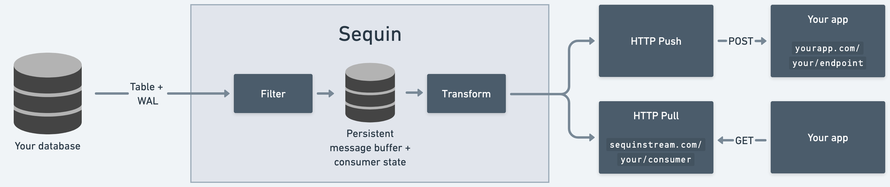

# Sequin

### Stream Postgres tables

 

  <a href="https://console.sequinstream.com">Sequinstream.com</a>
  ·
  <a href="https://sequinstream.com/docs">Documentation</a>
  ·
  <a href="https://sequinstream.com">Website</a>

## What is Sequin?

Sequin streams data out of your Postgres database. You can use it to **replicate data** from your existing tables to other apps, databases, caches, materialized views, or frontend clients. Or you can use it to build **event processing workflows**, such as triggering side effects when data in Postgres changes.

Sequin itself is built on Postgres. It uses the Write Ahead Log (WAL) to detect changes and internal tables to store consumer state. Without Sequin, you'd need to cobble together tools like [Debezium](#sequin-vs-debezium--kafka) and [Kafka](#sequin-vs-kafka).

Sequin is a standalone Docker container that you can deploy in front of your Postgres database. Or, you can use [our hosted offering](https://sequinstream.com).

Sequin is open source/MIT. We can't wait to see what you build.

## Killer features

- **Never miss a record or change:** Sequin ensures all database changes are delivered and processed exactly once by consumers.
- **SQL-based routing:** Filter and route messages to consumers using SQL `where` conditions.
- **Replays:** Rewind consumers to any row on your table. Or republish select messages that match a SQL query.
- **Start anywhere:** Consumers can start processing records from any point in a table.
- **Bring your database:** Sequin is not an extension. It works with any Postgres database version 12\+.
- **No PL/pgSQL:** Define business logic in the language of your choice and in your application.
- **Transforms** \(coming soon\!\): Transform message payloads by writing functions in Lua, JavaScript, or Go.

## Cloud

[**Try Sequinstream.com now →**](https://console.sequinstream.com/register)

## How Sequin works

Sequin keeps your data in your Postgres database. You can use your existing database in a new way without copying the data to a new system or mastering a new technology.

Sequin connects to any Postgres database via both direct table reads (i.e. `select`) and the WAL. Consumers can start processing rows at any point in the table. Sequin turns the table's rows into a stream of messages. You can read those messages over an HTTP interface similar to SQS, or Sequin can push changes to you via webhooks.

As rows are inserted or updated, Sequin will redeliver them to consumers.

With [WAL Pipelines](#wal-pipelines), you can capture discrete changes to your tables, including `OLD` values for updates and hard-deletes. Sequin will write changes to an event log table in your database, so you can stream these changes with Sequin.

You can run Sequin in its own Docker container or as a sidecar container in your existing deployment.

Sequin comes with a web console/UI for configuration:

1. Connect any Postgres database to Sequin (Sequin uses logical replication).
2. Select the tables, actions, and SQL filters that publish messages to your consumers.
3. Consume messages using HTTP pull and push interfaces. (You can use our SDKs.)

You can configure Sequin as code using TOML config files (coming soon).

## Benchmarks

Sequin efficiently captures changes using the Write Ahead Log. This adds virtually no overhead to the performance of your database. If your database can handle the transaction, so can Sequin with minimal latency.

Postgres Performance is highly dependent on machine resources. But to give you an idea, a `db.m5.xlarge` RDS instance (4 vCPU, 16 GB RAM, $260/mo) can handle inserts at 5,000 messages/second, with bursts up to 10k messages/second.

## Use cases

**Replication:** Sync data to other systems to update search indexes, invalidate caches, and generate denormalized views.

**Trigger side-effects:** Never miss a change in your database for processing by other systems.

**Fan out:** Broadcast events, distribute workloads, and decouple services.

## Sequin vs Kafka

Apache Kafka is a distributed event streaming platform. Kafka is designed for very high throughput and horizontal scalability.

You can think of Sequin as a more ergonomic, Postgres-based alternative. With Sequin, you can turn a Postgres table into something that behaves like a Kafka topic. You can create new consumers that process messages in order, starting at any offset in the table you specify. Because all your data lives at rest in Postgres, the data model is easy to understand and work with.

Sequin's consumer pattern is much simpler than Kafka's. Kafka uses partitions and offsets for concurrent consumption, whereas Sequin uses a message queue pattern similar to SQS. This means concurrency is flexible and you can scale workers up and down without making any configuration changes.

Consumers can also use SQL-based filtering to consume a subset of rows from a table. This is far more dynamic than Kafka's topic model, where consumer groups need to consume all data from a topic.

While Kafka may be necessary for very high throughput use cases (logs or metrics, millions of messages per second), Postgres and Sequin are able to handle a lot of use cases with a lot less complexity (even modest Postgres instances can handle tens of thousands of messages per second).

## Sequin vs Debezium + Kafka

Debezium is a change data capture (CDC) tool for databases like Postgres. It requires an external messaging system like Kafka to operate.

Like Sequin, you can use Debezium + Kafka to replicate data or build event processing workflows.

Debezium is a complex system that requires a lot of setup and configuration.

Sequin is simpler to setup and operate, yet is quickly becoming as comprehensive as Debezium. Sequin comes with a much more comprehensive UI for configuration and monitoring. And Sequin doesn't require another messaging system like Kafka to learn and operate. With [WAL Pipelines](#wal-pipelines) you can capture the same changes that Debezium does.

## Sequin vs PG Triggers

[PG Triggers](https://www.postgresql.org/docs/current/sql-createtrigger.html) provide exactly-once processing guarantees within the context of your database. For instance, you can ensure that when a record is inserted in one table, it is appended to another.

Sequin extends this guarantee outside of your database with a simple HTTP interface. Notably, Sequin is much more efficient at processing changes - as the trigger is captured via the WAL while Postgres triggers execute per row, inside transactions.

## Sequin vs LISTEN / NOTIFY

[`NOTIFY`](https://www.postgresql.org/docs/current/sql-notify.html) delivers a message to any channel listening for changes. It's a simple pub/sub model with at-most once delivery guarantees. If a change happens and no channel is available to hear it - it's gone forever.

Sequin adds a HTTP interface and persistent, durable messaging to provide exactly-once processing guarantees to the NOTIFY implementation. Paired with filtering, transforms, and observability - Sequin is easier to use and monitor.

## Amazon SQS

Amazon Simple Queue Service (SQS) is a message queuing service. It offers exactly-once processing over an HTTP interface.

Sequin's HTTP pull interface is a lot like SQS's HTTP pull interface. Except, Sequin isn't really a queue; it's better thought of as a stream. Because Sequin is streaming your Postgres tables, messages aren't deleted after they're processed. This means consumers can rewind and replay records, or start anywhere in the table.

So, Sequin is kind of like combining your Postgres table with SQS, like you might do with a system like Debezium.

## WAL Pipelines

Sequin streams rows from your Postgres tables. To capture and stream discrete changes to your tables – including `OLD` values for updates and hard-deletes – you can use **WAL Pipelines**. WAL Pipelines insert WAL records into an append-only event log table in your database. You can then stream these changes with Sequin.

## Documentation

For Sequin's complete documentation, visit [sequinstream.com/docs](http://sequinstream.com/docs).

## Quick start

Sequin is available as a cloud version or self-hosted. See the following docs to get up and running quickly:

- [Sequin cloud quickstart](https://sequinstream.com/docs/quickstart)
- [Sequin self-hosted quickstart](https://sequinstream.com/docs/self-hosting/docker-compose)

## Contribute

Sequin is open-sourced with an MIT license. The project is just getting started, so the best way to contribute right now is to open an issue or send us a note: [support@sequinstream.com](mailto:support@sequinstream.com)
