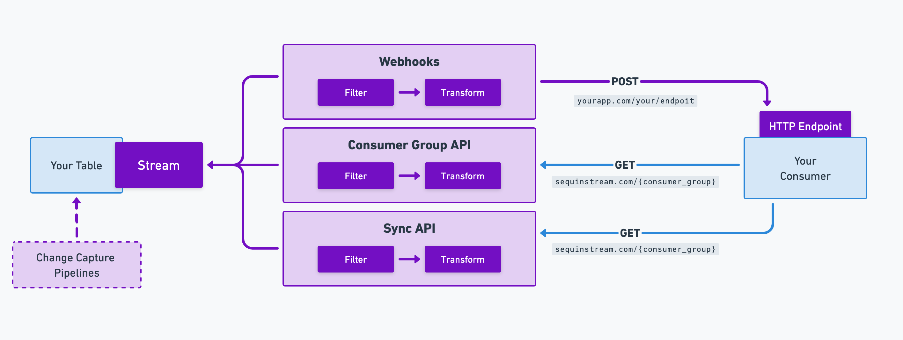

# Sequin

### Postgres CDC to streams and queues like Kafka, SQS, HTTP endpoints, and more

 

  <a href="https://console.sequinstream.com">Sequinstream.com</a>
  ·
  <a href="https://sequinstream.com/docs">Documentation</a>
  ·
  <a href="https://sequinstream.com">Website</a>
  ·
  <a href="https://discord.gg/BV8wFXvNtY">Discord</a>

## What is Sequin?

Sequin is a tool for change data capture (CDC) in Postgres. Sequin makes it easy to stream Postgres rows and changes to streaming platforms and queues (e.g. Kafka and SQS). You can backfill existing rows and stream new changes in real-time.

Sequin even has a built-in stream interface (HTTP GET and webhooks), so you can get started without any other infrastructure.

CDC enables applications and services to track and respond to row-level changes in database tables as they occur. With CDC via Sequin, you can:

1. **Replicate data** from your existing tables to other apps, databases, caches, materialized views, or frontend clients.
2. **Build event driven workflows** such as triggering side effects when data in Postgres changes.

Sequin itself is [built on Postgres](https://sequinstream.com/docs/how-sequin-works). It uses a logical replication slot to detect changes and internal tables to store consumer state.

Unlike Debezium, another CDC tool, Sequin doesn't require Kafka or Zookeeper to operate. Sequin is a standalone Docker container that you can deploy in front of your Postgres database. Or, you can use [our hosted offering](https://sequinstream.com).

Sequin is open source/MIT. To help us make this project great, tell us what you're building in our [Discord Server](https://discord.gg/BV8wFXvNtY).

## Destinations

| Destination | Support | Description |
|-------------|---------|-------------|
| SQS | ✅ Real-time streaming ✅ Backfill existing rows | |
| Redis | ✅ Real-time streaming ✅ Backfill existing rows | `XADD` to Redis Streams |
| Webhook Subscription (Native) | ✅ Real-time streaming ✅ Backfill existing rows | Send changes to any HTTP endpoint |
| HTTP Pull (Native) | ✅ Real-time streaming ✅ Backfill existing rows | Consume changes directly from Sequin with exactly-once processing |
| Kafka | Coming soon | (Nov 2024) |
| NATS JetStream | Coming soon | (Nov 2024) |
| Azure EventHubs | Coming soon | (Nov 2024) |
| Google Pub/Sub | Coming soon | (Nov 2024) |
| Amazon SNS | Coming soon | (Nov 2024) |
| AWS Kinesis | Coming soon | (Dec 2024) |
| RabbitMQ | Coming soon | (Dec 2024) |
| RedPanda | Coming soon | (Dec 2024) |

## Killer features

- **Never miss a record or change:** Sequin ensures all database changes are delivered to destinations.
- **SQL-based routing:** Filter and route messages to destinations using SQL `where` conditions.
- **Backfills:** Backfill existing rows from your tables to destinations.
- **Start anywhere:** Destinations can start receiving records from any point in a table.
- **Bring your database:** Sequin is not an extension. It works with any Postgres database version 12\+.
- **Transforms** \(coming soon\!\): Transform message payloads by writing functions in Lua, JavaScript, or Go.

## Use cases

- **Triggering a workflow when data changes in Postgres:** Execute custom business logic whenever specific rows are inserted, updated, or deleted in your database.
- **Making events available to downstream services:** Stream changes from your database tables as events that other services can consume.
- **Informing downstream services when rows change:** Notify dependent services about data changes to keep systems in sync.
- **Audit logging:** Track and record all changes made to data in your database for compliance or feature development.
- **Sync a table from one database to another:** Keep tables synchronized across different database instances in real-time.
- **Materializing another table in your database:** Create and maintain derived tables based on changes to source tables.
- **Maintaining a cache:** Keep caches up-to-date by streaming database changes.
- **Refreshing search indexes:** Keep search indexes fresh by streaming updates from your database.

## Getting started

See our [quickstart](https://sequinstream.com/docs/quickstart/setup).

Alternatively, you can try Sequin for free on [Sequin Cloud](https://console.sequinstream.com/register). Follow the instructions in the app to start streaming your data in a couple minutes.

## How Sequin works

Sequin connects to any Postgres database. To stream data, you'll create [Streams](https://sequinstream.com/docs/how-sequin-works#Streams) for each table you want to stream. Streams present a strictly ordered view of rows from one or more tables.

Then, you'll connect your Streams to destinations, like SQS or HTTP endpoints. As rows are inserted or updated, Sequin will redeliver them until acknowledged.

With [Change Capture Pipelines](https://sequinstream.com/docs/capture-changes/wal-pipelines), you can capture discrete changes to your tables, including `OLD` values for updates and hard-deletes. Sequin will write changes to an event log table in your database, so you can stream these changes with Sequin.

Sequin comes with a web console/UI for configuration.

You can configure Sequin as code using YAML config files.

## Benchmarks

Sequin efficiently captures changes using logical replication. Except at very extreme scale, logical replication adds little overhead to the performance of your database. If your database can handle the transaction, so can Sequin with minimal latency.

Postgres Performance is highly dependent on machine resources. But to give you an idea, a `db.m5.xlarge` RDS instance (4 vCPU, 16 GB RAM, $260/mo) can handle inserts at 5,000 messages/second, with bursts up to 10k messages/second.

## How Sequin compares

Sequin vs Debezium

### Sequin vs Debezium

Debezium is also a CDC tool that captures changes from Postgres and streams them to messaging systems like Kafka. Debezium requires significant infrastructure (Kafka, Zookeeper, Connect) to operate.

Sequin provides the same CDC capabilities but with a much simpler setup:

1. **No Kafka required**: Sequin doesn't require Kafka or Zookeeper.
2. **Native destinations**: With Debezium, you route to destinations via Kafka Connect. With Sequin, you stream directly to your destination of choice. This means simpler setup, fewer transforms, and fewer moving parts.
3. **Full-featured web console**: Sequin includes a web console for configuration and monitoring.

Sequin vs Fivetran/Airbyte

### Sequin vs Fivetran/Airbyte

Fivetran and Airbyte are ETL tools designed primarily for data warehouse ingestion. They excel at moving data in batch intervals (minutes to hours) to analytical databases.

Sequin is purpose-built for real-time operational use cases. Key differences:

1. **Real-time streaming**: Versus batch intervals.
2. **Focus on operational destinations**: Queues, streams, webhooks, etc. vs data warehouses.
3. **Flexible backfills**: Deployed a bug and need to replay the last 2 hours of data? Sequin makes it easy.

Sequin vs custom CDC solutions

### Sequin vs custom CDC solutions

Many teams build custom CDC solutions using triggers, LISTEN/NOTIFY, or logical replication. While these can work, they often:

- Lack exactly-once processing guarantees
- Don't scale
- Don't handle backfills well
- Need ongoing maintenance
- Become a burden when the engineer who built it leaves the team

Sequin provides all this functionality out of the box:
- Exactly-once processing
- Seamless backfills
- Automatic retries and error handling
- Simple monitoring and observability
- Zero maintenance of CDC infrastructure

## Contribute

Sequin is open source (MIT license). The project is just getting started, so the best way to contribute right now is to open an issue or join the [Discord Server](https://discord.gg/BV8wFXvNtY) and let us know what you want to build.
