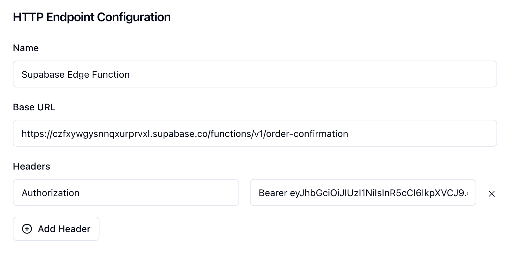

## Triggering a Supabase edge function with Sequin

Sequin can trigger Supabase edge functions by calling the function's endpoint URL. This is an alternative to triggering Supabase edge functions with Supabase webhooks. Sequin improves on the Supabase workflow by offering more features, like retries for failed events.

<Steps titleSize="h3">
  <Step title="Update the edge function to process Sequin's payload">
    Update the edge function to process Sequin's event payload. Note that while Sequin's `record` payload is the same, the keys `changes`, `actions`, and `metadata` are different:

    <CodeGroup>
        ```json Supabase insert
        {
        "type": "INSERT",
        "table": "orders",
        "record": {
            "id": 4,
            "user_id": 4,
            "order_date": "2024-09-03T18:32:48.108729+00:00",
            "total_amount": 154.97
        },
        "schema": "public",
        "old_record": null
        }
        ```

        ```json Sequin insert
        {
        "record": {
            "id": 5,
            "order_date": "2024-09-03T19:41:17Z",
            "total_amount": "154.97",
            "user_id": 5
        },
        "metadata": {
            "consumer": {
            "id": "107adb3d-76b4-40ba-8e9d-587f9871ab5c",
            "name": "new_order"
            },
            "table_name": "orders",
            "table_schema": "public",
            "commit_timestamp": "2024-09-03T19:41:17.650384Z"
        },
        "action": "insert",
        "changes": null
        }
        ```
    </CodeGroup>
  </Step>
  <Step title="Deploy the edge function and retrieve the URL">
    Using the Supabase CLI, deploy your edge function:

    ```bash
    supabase functions deploy {your-function-name}
    ```

    Once deployed, you can retrieve the URL of the edge function by logging into the Supabase Dashboard and navigating to the Edge Functions page:

    <Frame>
        
    </Frame>

  </Step>
  <Step title="Create a Sequin push consumer">
    With your edge function URL in hand, you 'll create a Sequin push consumer:
    * Set the endpoint to the edge function URL.
    * Add an authentication to your POST request with the key `Authorization` and the value `Bearer YOUR_SUPABASE_ANON_KEY`.

    <Frame>
        
    </Frame>

    <Note>
      The `Authorization` header is required to authenticate the request with the edge function. You can find your `SUPABASE_ANON_KEY` in the **Settings > API** page in the Supabase Dashboard. If you don't want to authenticate your request (i.e. make the edge function public), you can deploy the edge function with the `--no-verify-jwt` flag.
    </Note>


  </Step>
</Steps>

<Check>Now, when you make a change in your Supabase database that meets the consumer's filter criteria, Sequin will capture the change and send it to the edge function.</Check>

## Next steps

Sequin is a great complement to Supabase. This guide showed you how to connect Supabase to Sequin and start moving your webhooks and edge function triggers to Sequin. From here, you may want to:

* Refine your webhooks / triggers by using more specific filters. Perhaps you can move logic out of your edge function and into your consumer filters.
* Use Sequin's replay and backfill features to run historical data through your edge function.
* Use Sequin's observability features to monitor and debug your webhooks and triggers.