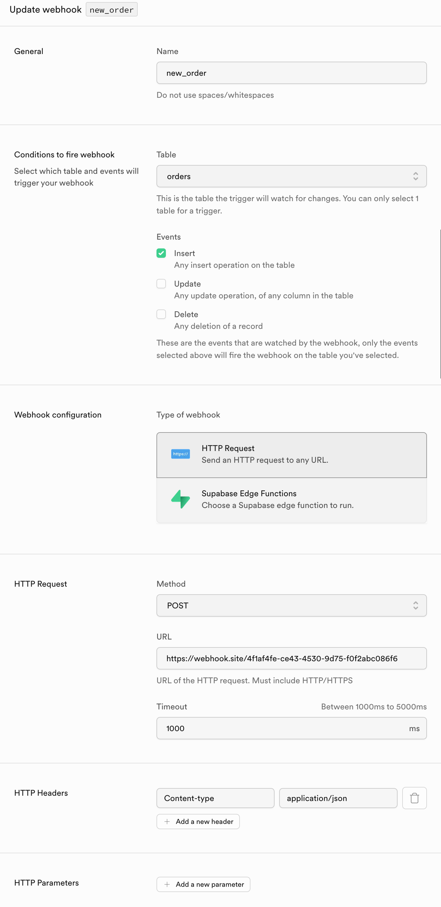

This guide shows you how to migrate Supabase webhooks to Sequin webhook sinks.

You may want to move your existing Supabase webhooks to Sequin because Sequin webhook sinks provide additional features, observability, and reliability:

* Exactly-once processing guarantees ensuring every event is processed once and only once.
* Automatic retries and backoff for failed events.
* Filtering of events with no PL/pgSQL required.
* Backfill support to sync historical data.
* End-to-end observability and debugging tools for failed events.
* Sinks to other streams and queues like SQS and Kafka.

You can easily move your existing Supabase webhooks to Sequin by creating Sequin HTTP push consumers.

## Prerequisites

You are about to migrate a Supabase webhook to a Sequin webhook sink that sends HTTP POST requests to your endpoint when database rows change.

You'll need the following:

- A [Supabase](https://supabase.com) project
- Sequin [installed locally](/quickstart/webhooks)
- Your Supabase database [connected to Sequin](/how-to/setup-supabase)


## Example Supabase webhook to migrate

As an example, here's a webhook trigger in Supabase for a hypothetical `orders` table:

<Tabs>
  <Tab title="SQL">
  ```sql
    create trigger new_order
    after insert on public.orders
    for each row
    execute function supabase_functions.http_request ('https://webhook.site/4f1af4fe-ce43-4530-9d75-f0f2abc086f6', 'POST', '{"Content-type":"application/json"}', '{}', '1000')
    ```
  </Tab>
  <Tab title="Supabase Console">
    <Frame>
        
    </Frame>
  </Tab>
</Tabs>


In this example, a postgres trigger fires anytime a new record is added to the `orders` table. The trigger then fires a webhook (via `pg_net`) to send the data to an HTTP endpoint.

When the trigger fires, Supabase sends the data to the endpoint with the following payload:

```json
{
  "type": "INSERT",
  "table": "orders",
  "record": {
    "id": 4,
    "user_id": 4,
    "order_date": "2024-09-03T18:32:48.108729+00:00",
    "total_amount": 154.97
  },
  "schema": "public",
  "old_record": null
}
```

## Create a Sequin webhook sink

To replicate this exact webhook in Sequin, you'll create a webhook sink on the `orders` table with no filters. Here's how to do it:

<Steps titleSize="h3" >
  <Step title="Create a new sink">
    Navigate to the "Sinks" tab, click the "Create Sink" button, and select "Webhook Sink".
  </Step>

  <Step title="Select source tables">
    Select the schemas and tables you want to capture changes from (i.e `public.users` or `public`).
  </Step>

  <Step title="Add filters (optional)">
    Add [filters](/reference/filters) to the sink to control which database changes are sent to your webhook endpoint.
  </Step>

  <Step title="Configure backfill">
    Leave "Backfill" toggled off for now.
  </Step>

  <Step title="Configure message grouping">
    Under "Message grouping", leave the default option selected to ensure events for the same row are sent to your webhook endpoint in order.
  </Step>

  <Step title="Configure sink settings">
    Under "Webhook Sink configuration" leave the defaults:

    - Leave the default value of `30000 ms` for "Request timeout" as this is more than enough time for your function to process the request
    - Leave the default value of `1` for "Batch size" for now to mimic the behavior of the Supabase webhook.
  </Step>

  <Step title="Configure HTTP endpoint">
    Add your webhook URL and any required headers.

    <Note>Sequin gives you more control over webhook delivery and retries including a higher request timeout, automatic retries, and the ability to configure max ack pending (e.g. the consumer will stop sending new events to the endpoint if a certain number of events are not acknowledged). Additionally, you can authenticate the messages delivered to your endpoint with encrypted headers.</Note>
  </Step>

  <Step title="Name and create sink">
    Give your sink a name (e.g. `orders_webhook_sink`) and click "Create Webhook Sink".
  </Step>
</Steps>

Now, when you create a new order in Supabase, Sequin will capture the change and send it to your endpoint:

```json
{
  "record": {
    "id": 5,
    "order_date": "2024-09-03T19:41:17Z",
    "total_amount": "154.97",
    "user_id": 5
  },
  "metadata": {
    "table_schema": "public",
    "table_name": "orders",
    "commit_timestamp": "2024-09-03T19:41:17.650384Z",
    "commit_lsn": 123456789,
    "commit_idx": 1,
    "database_name": "myapp-prod",
    "consumer": {
      "id": "107adb3d-76b4-40ba-8e9d-587f9871ab5c",
      "name": "new_order",
      "annotations": {}
    },
    "database": {
      "id": "12345678-9abc-def0-1234-56789abcdef0",
      "name": "myapp-prod",
      "annotations": {},
      "database": "myapp-prod",
      "hostname": "db.example.com"
    }
  },
  "action": "insert",
  "changes": null
}
```

<Note>
  Sequin's [data payload](/reference/sinks/webhooks#request-format) is slightly different than Supabase's webhook payload:
  * Sequin's `metadata` field includes additional metadata about the consumer and the table.
  * Sequin captures the operation type (e.g. `insert`, `update`, `delete`) in the `action` field not the `type` field.
  * Sequin captures changes for `update` and `delete` operations in the `changes` field not the `old_record` field.
    * **Updates:** Sequin's `changes` object only contains the changed columns and their old values, while Supabase's `old_record` field contains the prior state of the entire record before it was updated.
    * **Deletes:** Sequin's `record` field contains the prior state of the record before it was deleted and the `changes` field is `null`, while Supabase's `old_record` contains the the prior state of the record before it was deleted and the `record` field is `null`.
</Note>
