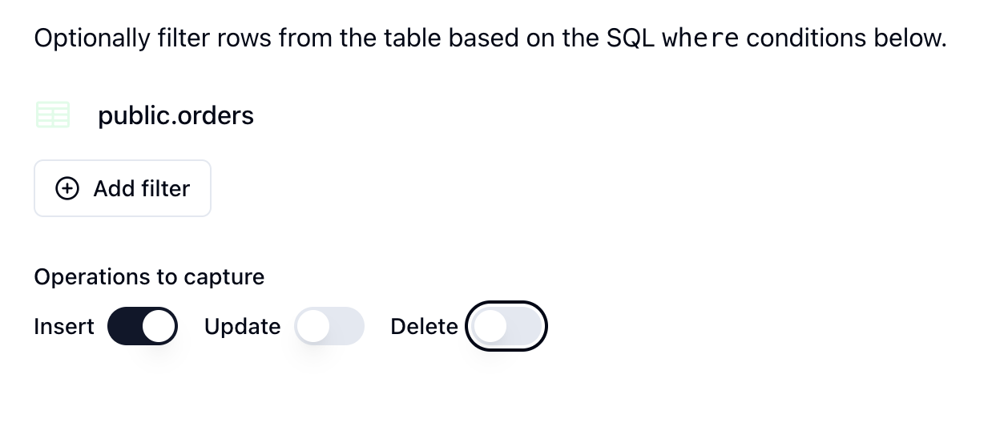

## Moving Supabase webhooks to Sequin

Sequin has some helpful features that Supabase webhooks lack:

* Exactly-once processing guarantees ensuring every event is processed once and only once.
* Automatic retries and backoff for failed events.
* Filtering of events with no PL/pgSQL.
* Backfill support to sync historical data.
* Helpful observability and debugging tools.

You can easily move your existing Supabase webhooks to Sequin by creating Sequin HTTP push consumers.

### Example Supabase webhook to migrate

As an example, here's a webhook trigger in Supabase for a hypothetical `orders` table:

<Tabs>
  <Tab title="SQL">
  ```sql
    create trigger new_order
    after insert on public.orders
    for each row
    execute function supabase_functions.http_request ('https://webhook.site/4f1af4fe-ce43-4530-9d75-f0f2abc086f6', 'POST', '{"Content-type":"application/json"}', '{}', '1000')
    ```
  </Tab>
  <Tab title="Supabase Console">
    <Frame>
        
    </Frame>
  </Tab>
</Tabs>


In this example, a postgres trigger fires anytime a new record is added to the `orders` table. The trigger then fires a webhook (via `pg_net`) to send the data to an HTTP endpoint.

When the trigger fires, Supabase sends the data to the endpoint with the following payload:

```json
{
  "type": "INSERT",
  "table": "orders",
  "record": {
    "id": 4,
    "user_id": 4,
    "order_date": "2024-09-03T18:32:48.108729+00:00",
    "total_amount": 154.97
  },
  "schema": "public",
  "old_record": null
}
```

### Sequin HTTP push consumer

To create this exact webhook in Sequin, you'll create an HTTP push consumer on the `orders` table with no filters. Here's how to do it:

<Steps titleSize="h3" >
  <Step title="Select your database and table">
    In the Sequin Console, navigate to the Consumers page, click **Create Consumer**.

    Select your Supabase database and the `public.orders` table.
  </Step>
  <Step title="Set filters and operations">
    Don't configure any filters and set the consumer to capture just `INSERT` operations:
    <Frame>
        
    </Frame>
  </Step>
  <Step title="Select Change stream to HTTP Push">
    To mimic the behavior of the Supabase webhook, select **Change stream** as the stream type and then **HTTP Push** as the consumer type.
  </Step>
  <Step title="Add your webhook URL">
    Finally, give your consumer a name, set a timeout, and add your webhook URL:

    <Frame>
        
    </Frame>

    <Note>Sequin gives you more control over webhook delivery and retries including a higher request timeout, automatic retries, and the ability to configure max ack pending (e.g. the consumer will stop sending new events to the endpoint if a certain number of events are not acknowledged). Additionally, you can authenticate the messages delivered to your endpoint with encrypted headers.</Note>

  </Step>
  <Step title="Set the replica identity to `full`">
    Once you create your Consumer, Sequin will verify your configuration. To ensure Sequin can capture the `old` values for `update` and `delete` operations, you'll be prompted to set the replica identity to `full` by running the following SQL command:

    ```sql
   alter table orders replica identity full;
    ```
  </Step>
</Steps>

Now, when you create a new order in Supabase, Sequin will capture the change and send it to your endpoint:

```json
{
  "record": {
    "id": 5,
    "order_date": "2024-09-03T19:41:17Z",
    "total_amount": "154.97",
    "user_id": 5
  },
  "metadata": {
    "consumer": {
      "id": "107adb3d-76b4-40ba-8e9d-587f9871ab5c",
      "name": "new_order"
    },
    "table_name": "orders",
    "table_schema": "public",
    "commit_timestamp": "2024-09-03T19:41:17.650384Z"
  },
  "action": "insert",
  "changes": null
}
```

<Note>
  Sequin's data payload is slightly different than Supabase's webhook payload:
  * Sequin's `metadata` field includes additional metadata about the consumer and the table.
  * Sequin captures the operation type (e.g. `insert`, `update`, `delete`) in the `action` field not the `type` field.
  * Sequin captures changes for `update` and `delete` operations in the `changes` field not the `old_record` field.
    * **Updates:** Sequin's `changes` object only contains the changed columns and their old values, while Supabase's `old_record` field contains the prior state of the entire record before it was updated.
    * **Deletes:** Sequin's `record` field contains the prior state of the record before it was deleted and the `changes` field is `null`, while Supabase's `old_record` contains the the prior state of the record before it was deleted and the `record` field is `null`.
</Note>