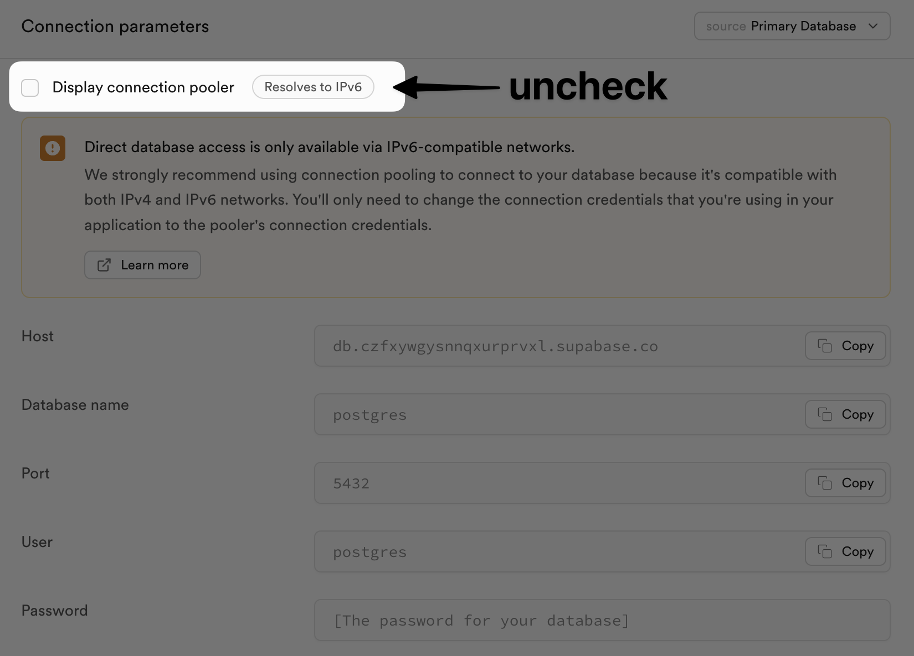
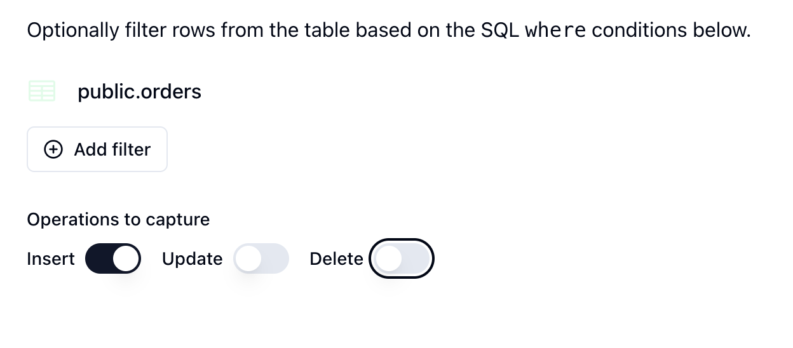
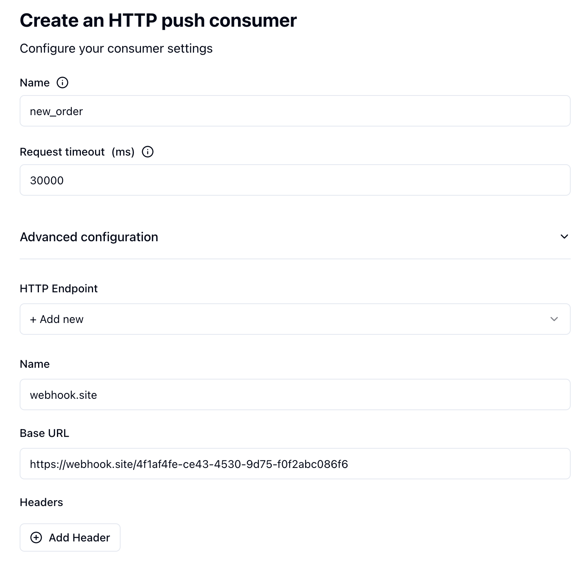
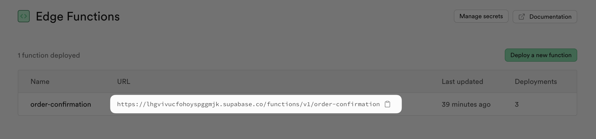
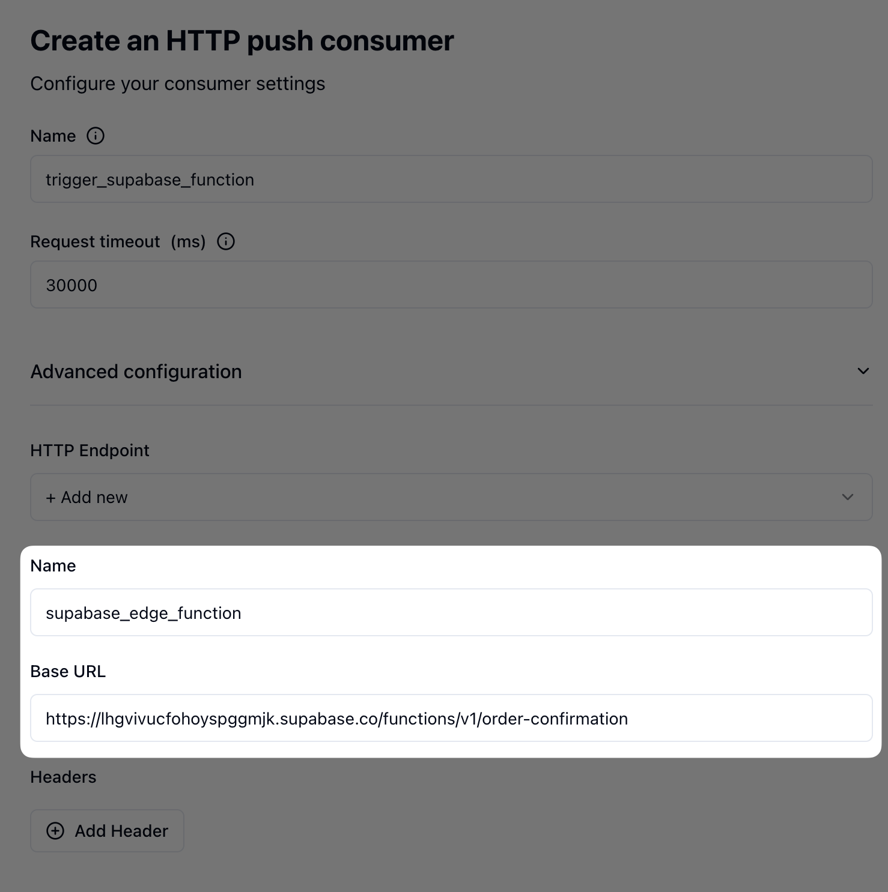

<iframe
  width="560"
  height="315"
  src="https://www.youtube.com/embed/mDPI4iq1dGM"
  title="YouTube video player"
  frameborder="0"
  allow="accelerometer; autoplay; clipboard-write; encrypted-media; gyroscope; picture-in-picture"
  allowfullscreen
></iframe>

## Connect to Supabase with a direct connection

Sequin uses the Write Ahead Log (WAL) to capture changes from your Supabase database. Supabase's connection pooling does not support the WAL, so you need to connect to your Supabase database using a direct connection.

Here is how to set up a direct connection in Supabase:

<Steps titleSize="h3">
  <Step title="Navigate to your database settings">
    Login to Supabase and navigate to the database settings page (**Settings > Configurations > Database**).
  </Step>
  <Step title="Get direct connection credentials">
    Disable the **Use connection pooling** option to show your direct connection credentials:
    <Frame>
        
    </Frame>
    <Check>Sequin is fully compatible with Supabase's IPv6 network.</Check>
  </Step>
  <Step title="Enter the connection details in Sequin">
    In Sequin, enter the direct connection details in the **Database connection** page including the **Host**, **Port**, **Database**, **User**, and **Password**.

    For Supabase, turn **SSL** on.
  </Step>
</Steps>

Sequin will automatically detect that you're using a Supabase database and will check that your connection is configured correctly.

<Check>Sequin is now connected to your Supabase database.</Check>

## Create a replication slot in Supabase

With your database connected, you'll now create the replication slot that Sequin will use to detect changes in your database.

<Steps titleSize="h3">
  <Step title="Create a replication slot">
    In the Supabase SQL editor, run the following SQL command to create a replication slot:

    ```sql
    select pg_create_logical_replication_slot('sequin_slot', 'pgoutput');
    ```

    This creates a replication slot named `sequin_slot`.
  </Step>
  <Step title="Create a publication">
    Next, you'll create a publication to indicate which tables will publish changes to the replication slot.

    In the SQL editor, run the following SQL command to create a publication:

    ```sql
    create publication sequin_pub for table table1, table2, table3;
    ```

    If you want to publish changes from all the tables in your database, you can also use the `for all tables` option:

    ```sql
    create publication sequin_pub for all tables;
    ```
  </Step>
  <Step title="Enter the replication slot details in Sequin">
    Back in the Sequin Console, enter the name of the replication slot (e.g. `sequin_slot`) and publication (e.g. `sequin_pub`) you just created. Then, name your database and click **Create Database**.
  </Step>
</Steps>

<Check>Sequin will now capture rows and changes from your Supabase database.</Check>

## Moving Supabase webhooks to Sequin

Sequin has some helpful features that Supabase webhooks lack:

* Exactly-once processing guarantees ensuring every event is processed once and only once.
* Automatic retries and backoff for failed events.
* Filtering of events with no PL/pgSQL.
* Backfill support to sync historical data.
* Helpful observability and debugging tools.

You can easily move your existing Supabase webhooks to Sequin by creating Sequin HTTP push consumers.

### Example Supabase webhook to migrate

As an example, here's a webhook trigger in Supabase for a hypothetical `orders` table:

<Tabs>
  <Tab title="SQL">
  ```sql
    create trigger new_order
    after insert on public.orders
    for each row
    execute function supabase_functions.http_request ('https://webhook.site/4f1af4fe-ce43-4530-9d75-f0f2abc086f6', 'POST', '{"Content-type":"application/json"}', '{}', '1000')
    ```
  </Tab>
  <Tab title="Supabase Console">
    <Frame>
        
    </Frame>
  </Tab>
</Tabs>


In this example, a postgres trigger fires anytime a new record is added to the `orders` table. The trigger then fires a webhook (via `pg_net`) to send the data to an HTTP endpoint.

When the trigger fires, Supabase sends the data to the endpoint with the following payload:

```json
{
  "type": "INSERT",
  "table": "orders",
  "record": {
    "id": 4,
    "user_id": 4,
    "order_date": "2024-09-03T18:32:48.108729+00:00",
    "total_amount": 154.97
  },
  "schema": "public",
  "old_record": null
}
```

### Sequin HTTP push consumer

To create this exact webhook in Sequin, you'll create an HTTP push consumer on the `orders` table with no filters. Here's how to do it:

<Steps titleSize="h3" >
  <Step title="Select your database and table">
    In the Sequin Console, navigate to the Consumers page, click **Create Consumer**.

    Select your Supabase database and the `public.orders` table.
  </Step>
  <Step title="Set filters and operations">
    Don't configure any filters and set the consumer to capture just `INSERT` operations:
    <Frame>
        
    </Frame>
  </Step>
  <Step title="Select Change stream to HTTP Push">
    To mimic the behavior of the Supabase webhook, select **Change stream** as the stream type and then **HTTP Push** as the consumer type.
  </Step>
  <Step title="Add your webhook URL">
    Finally, give your consumer a name, set a timeout, and add your webhook URL:

    <Frame>
        
    </Frame>

    <Note>Sequin gives you more control over webhook delivery and retries including a higher request timeout, automatic retries, and the ability to configure max ack pending (e.g. the consumer will stop sending new events to the endpoint if a certain number of events are not acknowledged). Additionally, you can authenticate the messages delivered to your endpoint with encrypted headers.</Note>

  </Step>
  <Step title="Set the replica identity to `full`">
    Once you create your Consumer, Sequin will verify your configuration. To ensure Sequin can capture the `old` values for `update` and `delete` operations, you'll be prompted to set the replica identity to `full` by running the following SQL command:

    ```sql
   alter table orders replica identity full;
    ```
  </Step>
</Steps>

Now, when you create a new order in Supabase, Sequin will capture the change and send it to your endpoint:

```json
{
  "record": {
    "id": 5,
    "order_date": "2024-09-03T19:41:17Z",
    "total_amount": "154.97",
    "user_id": 5
  },
  "metadata": {
    "consumer": {
      "id": "107adb3d-76b4-40ba-8e9d-587f9871ab5c",
      "name": "new_order"
    },
    "table_name": "orders",
    "table_schema": "public",
    "commit_timestamp": "2024-09-03T19:41:17.650384Z"
  },
  "action": "insert",
  "changes": null
}
```

<Note>
  Sequin's data payload is slightly different than Supabase's webhook payload:
  * Sequin's `metadata` field includes additional metadata about the consumer and the table.
  * Sequin captures the operation type (e.g. `insert`, `update`, `delete`) in the `action` field not the `type` field.
  * Sequin captures changes for `update` and `delete` operations in the `changes` field not the `old_record` field.
    * **Updates:** Sequin's `changes` object only contains the changed columns and their old values, while Supabase's `old_record` field contains the prior state of the entire record before it was updated.
    * **Deletes:** Sequin's `record` field contains the prior state of the record before it was deleted and the `changes` field is `null`, while Supabase's `old_record` contains the the prior state of the record before it was deleted and the `record` field is `null`.
</Note>

## Triggering a Supabase edge function with Sequin

Sequin can trigger Supabase edge functions by calling the function's endpoint URL. This is an alternative to triggering Supabase edge functions with Supabase webhooks. Sequin improves on the Supabase workflow by offering more features, like retries for failed events.

<Steps titleSize="h3">
  <Step title="Update the edge function to process Sequin's payload">
    Update the edge function to process Sequin's event payload. Note that while Sequin's `record` payload is the same, the keys `changes`, `actions`, and `metadata` are different:

    <CodeGroup>
        ```json Supabase insert
        {
        "type": "INSERT",
        "table": "orders",
        "record": {
            "id": 4,
            "user_id": 4,
            "order_date": "2024-09-03T18:32:48.108729+00:00",
            "total_amount": 154.97
        },
        "schema": "public",
        "old_record": null
        }
        ```

        ```json Sequin insert
        {
        "record": {
            "id": 5,
            "order_date": "2024-09-03T19:41:17Z",
            "total_amount": "154.97",
            "user_id": 5
        },
        "metadata": {
            "consumer": {
            "id": "107adb3d-76b4-40ba-8e9d-587f9871ab5c",
            "name": "new_order"
            },
            "table_name": "orders",
            "table_schema": "public",
            "commit_timestamp": "2024-09-03T19:41:17.650384Z"
        },
        "action": "insert",
        "changes": null
        }
        ```
    </CodeGroup>
  </Step>
  <Step title="Deploy the edge function and retrieve the URL">
    Using the Supabase CLI, deploy your edge function:

    ```bash
    supabase functions deploy {your-function-name}
    ```

    Once deployed, you can retrieve the URL of the edge function by logging into the Supabase Dashboard and navigating to the Edge Functions page:

    <Frame>
        
    </Frame>

  </Step>
  <Step title="Create a Sequin push consumer">
    With your edge function URL in hand, you 'll create a Sequin push consumer:
    * Set the endpoint to the edge function URL.
    * Add an authentication to your POST request with the key `Authorization` and the value `Bearer YOUR_SUPABASE_ANON_KEY`.

    <Frame>
        
    </Frame>

    <Note>
      The `Authorization` header is required to authenticate the request with the edge function. You can find your `SUPABASE_ANON_KEY` in the **Settings > API** page in the Supabase Dashboard. If you don't want to authenticate your request (i.e. make the edge function public), you can deploy the edge function with the `--no-verify-jwt` flag.
    </Note>


  </Step>
</Steps>

<Check>Now, when you make a change in your Supabase database that meets the consumer's filter criteria, Sequin will capture the change and send it to the edge function.</Check>

## Next steps

Sequin is a great complement to Supabase. This guide showed you how to connect Supabase to Sequin and start moving your webhooks and edge function triggers to Sequin. From here, you may want to:

* Refine your webhooks / triggers by using more specific filters. Perhaps you can move logic out of your edge function and into your consumer filters.
* Use Sequin's [HTTP pull consumer](/core-concepts#pull-consumers) to gain more control over event consumption.
* Use Sequin's replay and backfill features to run historical data through your edge function.
* Use Sequin's observability features to monitor and debug your webhooks and triggers.
