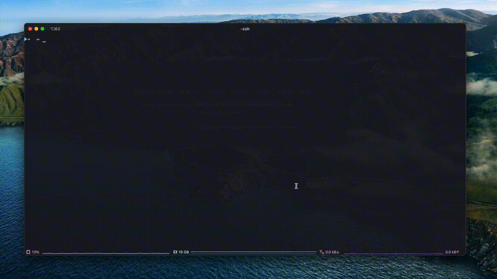

Instructions for Claude to generate the README from our docs

---

Please generate the @README.md for this project from the docs. In doing so, please convert any call-outs from Mintlify style (e.g. <Note></Note>) to GitHub style (e.g. [!NOTE]).

Also, fix any relative links in the docs to instead point to `https://sequinstream.com/docs/{path}`.

1. Copy verbatim from @introduction.mdx the first several sections, namely:

- What is Sequin?
- Stream not a queue
- Why Sequin?
- Killer features
- Works with any Postgres database
- Benchmarks and performance

2. Create a new section called "Installation." Copy from @quickstart.mdx:

- Install and boot Sequin (rename to "Installation")
- Server
- CLI

For the CLI, see the snippet @cli-installation-steps.mdx

3. Create a new section called Docs, copy verbatim:

## Docs

📖 [Find the full docs here](https://sequinstream.com/docs).

4. Create a new section called "Core concepts". Include sections from the doc @overview.mdx:

- Messages
- Key
- Streams
- Consumers (the whole section)
- Guarantees (the whole section)

Then, at the end, say "Learn more about [the core concepts of Sequin](#)"

5. Include this section verbatim:

## CLI

Sequin comes with a powerful CLI for managing and observing streams, messages, and consumers. [Read more about the CLI](https://sequinstream.com/docs/cli).

Sequin's `observe` is like [htop](https://github.com/htop-dev/htop) for your Sequin instance. You can watch messages flow into your system, into a consumer's outbox, and get ack'd in real-time.

Boot it with:

```bash
sequin observe
```



5.5. Include links out to SDKs, from @sdks.mdx. Say "Open an issue" not "Open an issue on GitHub."

6. Sources - include this section verbatim:

## Sources

Sequin has first-class support for ingesting messages from:

1. `postgres`: Existing Postgres tables (via the WAL)
2. `webhook`: External APIs

For example, with the `postgres` source, you can use Sequin to treat the creates, updates, and deletes from any existing Postgres table as a stream of messages.

[Learn more about sources](https://sequinstream.com/docs/core/sources).

7. Examples

Please generate examples of creating a stream, sending messages, and consuming with a consumer -- both using the CLI and using HTTP. Please keep all English prose concise and let the code do the talking.

8. Include this section verbatim:

## How it works

The Sequin server is a stateless Docker container that sits in front of any Postgres database. It provides an HTTP interface for sending and receiving messages, as well as managing the system.

Sequin uses a Postgres schema (default: `sequin_config`) to store metadata about streams, consumers, and other objects.

For the streams themselves, Sequin uses a separate Postgres schema (default: `sequin_stream`). That schema can live on a different Postgres database from the config.

There are two tables in `sequin_stream`: `messages` stores all the messages and `consumer_messages` stores the state of available and delivered messages for each consumer. `messages` is partitioned by stream. And `consumer_messages` is partitioned by consumer.

New messages are written to `messages` and fanned out to `consumer_messages` in the same transaction.

On insert, a message's `key` is tokenized and broken out across 16 token columns. This allows Sequin to leverage Postgres indexes for fast message lookups by key pattern (e.g. `payroll.adp.*.employee.*`).

### Design considerations

We tried and benchmarked several solutions, some that we felt were very clever. But we landed on a `messages` table with an outbox pattern (`consumer_message`) because it's both simple and performant!

Because consumer-message state needs to be tracked on disk, a `consumer_message` row needs to be created _at some point_. We decided it was best to do that on message insert. By moving more load to writes, we can avoid a situation where the system can write a lot faster than it can read.

For the best performance, on top of intelligent indexes, we avoid trigger functions (degrade performance when batching) and are careful about constraints.

## Deployments

You can run Sequin anywhere you can run Docker. You can even "sidecar" Sequin alongside your app.

Read more about [deploying Sequin](https://sequinstream.com/docs/deploying).
